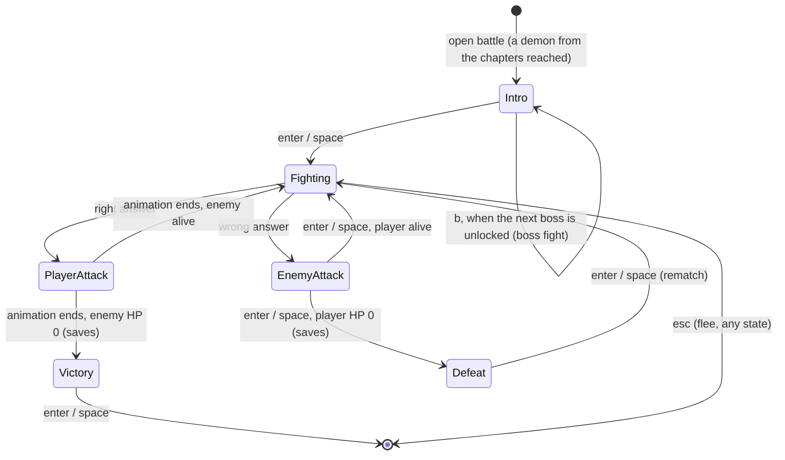

# Battle state chart

Generated from `internal/ui/rpg/states_test.go`, which also plays every
transition against the battle model. Regenerate with `make golden`.

```mermaid
stateDiagram-v2
    [*] --> Intro : open battle (a demon from the chapters reached)
    Intro --> Intro : b, when the next boss is unlocked (boss fight)
    Intro --> Fighting : enter / space
    Fighting --> PlayerAttack : right answer
    Fighting --> EnemyAttack : wrong answer
    PlayerAttack --> Fighting : animation ends, enemy alive
    PlayerAttack --> Victory : animation ends, enemy HP 0 (saves)
    EnemyAttack --> Fighting : enter / space, player alive
    EnemyAttack --> Defeat : enter / space, player HP 0 (saves)
    Defeat --> Fighting : enter / space (rematch)
    Victory --> [*] : enter / space
    Fighting --> [*] : esc (flee, any state)
```
